# skills — agent skill manager

`skills` is a zero-dependency Go binary that installs agent skills from
GitHub subdirectories. It replaces `gh skill install` with something
that actually works.

## State model

`skills` manages four layers of state — from declarative config to what is
actually on disk:

```mermaid
flowchart LR
  subgraph Manifest["📄 .manifest.json"]
    M[Declared intent:<br/>which skills, where,<br/>from what source]
  end
  subgraph Lock["🔒 .lock.json"]
    L[Resolved versions:<br/>pinned commit per skill]
  end
  subgraph Disk["💾 disk"]
    D[Actual files:<br/>~/.agents/skills/<br/>~/.codex/skills/<br/>~/.claude/skills/]
  end
  subgraph Mirrors["🔗 mirrors"]
    MR[Derived symlinks:<br/>shared→claude<br/>shared→opencode]
  end

  Manifest -->|skills install| Lock
  Lock -->|download| Disk
  Manifest -->|install/update| Mirrors
  Disk -.->|verify| Mirrors

  style Manifest fill:#1a1a2e,stroke:#e94560
  style Lock fill:#16213e,stroke:#0f3460
  style Disk fill:#0f3460,stroke:#53d769
  style Mirrors fill:#533483,stroke:#e94560
```



| Layer | File / Dir | Role |
|-------|-----------|------|
| **manifest** | `.manifest.json` | 期望状态 — what you want |
| **lock** | `.lock.json` | 已解析版本 — what you pinned |
| **disk** | `~/.agents/skills/`, etc. | 实际安装结果 — what you have |
| **mirrors** | (manifest field) | namespace 派生关系 — cross-agent sharing |

## Install

### Go (if you have Go installed)

```bash
go install github.com/cagedbird043/skills@latest
```

### curl

```bash
curl -sfL https://cagedbird.cn/skills/install.sh | sh
```

### Build from source

```bash
git clone https://github.com/cagedbird043/skills.git
cd skills
make install
```

## Quick start

```bash
# List all skills defined in the manifest
skills list

# Install all skills
skills install

# Install a single skill
skills install drawio

# Check skill directory integrity
skills verify

# Show skill details
skills info drawio
```

## Manifest format

Create a `.manifest.json` that declares directories, mirrors, and skills.
A complete example lives at [`examples/manifest.json`](examples/manifest.json):

```json
{
  "version": 1,
  "directories": [
    { "name": "shared",  "path": "~/.agents/skills" },
    { "name": "codex",   "path": "~/.codex/skills" },
    { "name": "claude",  "path": "~/.claude/skills" },
    { "name": "opencode","path": "~/.config/opencode/skills" }
  ],
  "mirrors": [
    { "from": "shared", "to": "claude" },
    { "from": "shared", "to": "opencode" }
  ],
  "skills": [
    {
      "name": "anysearch",
      "target": "shared",
      "source": {
        "repo": "cagedbird043/agent-skills",
        "ref": "main",
        "path": "skills/anysearch"
      }
    }
  ]
}
```

Run `skills install`. A `.lock.json` will be created next to your manifest
recording the exact commit of each installed skill.

| Field | Description |
|-------|-------------|
| `directories` | Named agent namespace directories (shared, codex, claude, opencode...) |
| `mirrors` | Cross-namespace symlink derivation: shared → claude = auto-symlink shared skills into claude |
| `skills[].name` | Skill name, must match the source directory name |
| `skills[].target` | Which directory to install into (must match a `directories[].name`) |
| `skills[].source.repo` | GitHub repo in `owner/repo` format |
| `skills[].source.ref` | Branch or tag to track |
| `skills[].source.path` | Path within the repo to the skill directory |

## Commands

| Command | Description |
|---------|-------------|
| `skills list` | List all skills with installation status |
| `skills install [name]` | Install from lock (zero API calls if locked) |
| `skills update [name]` | Check remote commits, update changed skills |
| `skills verify` | Check all skill directories exist on disk |
| `skills info <name>` | Show source, path, commit, and disk location |
| `skills completion <shell>` | Generate shell completion (zsh, bash) |

## Options

| Flag | Description |
|------|-------------|
| `-m, --manifest <path>` | Path to manifest file |
| `-q, --quiet` | Suppress normal output, errors only |
| `--version` | Print version |

## Environment

| Variable | Description |
|----------|-------------|
| `SKILLS_MANIFEST` | Default manifest path (alternative to `--manifest`) |
| `NO_COLOR` | Set to any value to disable colored output |

## Shell completion

```bash
# zsh
skills completion zsh > ~/.local/share/zsh/site-functions/_skills
# then add to .zshrc:
#   fpath=(~/.local/share/zsh/site-functions $fpath)

# bash
skills completion bash > ~/.local/share/bash-completion/completions/skills
```
