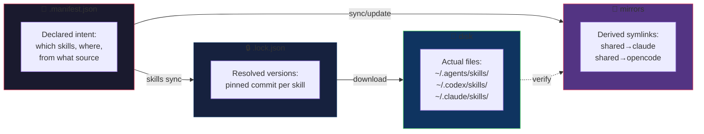

# skills — agent skill manager

`skills` is a zero-dependency Go binary that installs agent skills from
GitHub subdirectories. It replaces `gh skill install` with something
that actually works.

## State model

`skills` manages four layers of state — from declarative config to what is
actually on disk:


```mermaid
flowchart LR
  subgraph Manifest["📄 .manifest.json"]
    M[Declared intent:<br/>which skills, where,<br/>from what source]
  end
  subgraph Lock["🔒 .lock.json"]
    L[Resolved versions:<br/>pinned commit per skill]
  end
  subgraph Disk["💾 disk"]
    D[Actual files:<br/>~/.agents/skills/<br/>~/.codex/skills/<br/>~/.claude/skills/]
  end
  subgraph Mirrors["🔗 mirrors"]
    MR[Derived symlinks:<br/>shared→claude<br/>shared→opencode]
  end

  Manifest -->|skills sync| Lock
  Lock -->|download| Disk
  Manifest -->|sync/update| Mirrors
  Disk -.->|verify| Mirrors

  style Manifest fill:#1a1a2e,stroke:#e94560
  style Lock fill:#16213e,stroke:#0f3460
  style Disk fill:#0f3460,stroke:#53d769
  style Mirrors fill:#533483,stroke:#e94560
```

| Layer | File / Dir | Role |
|-------|-----------|------|
| **manifest** | `.manifest.json` | 期望状态 — what you want |
| **lock** | `.lock.json` | 已解析版本 — what you pinned |
| **disk** | `~/.agents/skills/`, etc. | 实际安装结果 — what you have |
| **mirrors** | (manifest field) | namespace 派生关系 — cross-agent sharing |

## Install

### Homebrew（推荐）

```bash
brew install cagedbird043/tap/skills-cli
```

### Go (if you have Go installed)

```bash
go install github.com/cagedbird043/skills@latest
```

### curl

```bash
curl -sfL https://cagedbird.cn/skills/install.sh | sh
```

### Build from source

```bash
git clone https://github.com/cagedbird043/skills.git
cd skills
make install
```

## Quick start

```bash
# List all skills defined in the manifest
skills list

# Reconcile all skills to disk
skills sync

# Reconcile a single skill to disk
skills sync drawio

# Install OMP-only skill into the active profile's native user dir
skills add DietrichGebert/ponytail skills/ponytail --target omp

# Report manifest/lock/disk/mirror drift
skills doctor

# Emit the same doctor report as machine-readable JSON
skills doctor --json

# Delete leftovers from interrupted installs (.<skill>.tmp-*/.old-*)
skills doctor --prune-tmp

# Show skill details
skills info drawio
```

## Manifest format

Create a `.manifest.json` that declares directories, mirrors, and skills.
A complete example lives at [`examples/manifest.json`](examples/manifest.json):

```json
{
  "version": 1,
  "directories": [
    { "name": "shared",  "path": "~/.agents/skills" },
    { "name": "codex",   "path": "~/.codex/skills" },
    { "name": "claude",  "path": "~/.claude/skills" },
    { "name": "opencode","path": "~/.config/opencode/skills" }
  ],
  "mirrors": [
    { "from": "shared", "to": "claude" },
    { "from": "shared", "to": "opencode" }
  ],
  "skills": [
    {
      "name": "anysearch",
      "target": "shared",
      "source": {
        "repo": "cagedbird043/agent-skills",
        "ref": "main",
        "path": "skills/anysearch"
      }
    }
  ]
}
```

Run `skills sync`. A `.lock.json` will be created next to your manifest,
recording each installed skill's exact commit and normalized content hash.

| Field | Description |
|-------|-------------|
| `directories` | Named agent namespace directories (shared, codex, claude, opencode...) |
| `mirrors` | Cross-namespace symlink derivation: shared → claude = auto-symlink shared skills into claude |
| `skills[].name` | Skill name, must match the source directory name |
| `skills[].target` | Which directory to install into. Usually matches a `directories[].name`; reserved target `omp` installs into the active OMP profile's native user skills dir. |
| `skills[].source.repo` | GitHub repo in `owner/repo` format |
| `skills[].source.ref` | Branch or tag to track |
| `skills[].source.path` | Path within the repo to the skill directory |

## Commands

| Command | Description |
|---------|-------------|
| `skills list` | List all skills with installation status |
| `skills sync [name]` | Reconcile manifest + lock to disk; restores modified locked content. `--dry-run` reports each item as `install`, `update`, `restore`, `remove`, or `unchanged`. |
| `skills install [name]` | Legacy alias for `sync` |
| `skills update [name]` | Check remote commits, update changed skills |
| `skills doctor` | Report active manifest path plus manifest/lock/disk/mirror drift |
| `skills doctor --json` | Emit the doctor report as one machine-readable JSON document |
| `skills doctor --prune-tmp` | Same report, then delete interrupted-install leftovers |
| `skills info <name>` | Show source, path, commit, and disk location |
| `skills completion <shell>` | Generate shell completion (zsh, bash) |

## Doctor statuses

`skills doctor` compares the manifest, lock, normalized installed content, and
mirrors. Each row names how they disagree.

| Status | Meaning | What to do |
|--------|---------|------------|
| `ok` | Manifest, lock, and disk agree | Nothing |
| `uninstalled` | Declared, but never installed | `skills sync` |
| `missing` | Locked, but files are gone from disk | `skills sync` |
| `stale-disk` | On disk without a lock entry, or installed commit marker differs from the lock | `skills sync` |
| `stale` | In the lock, but no longer declared | `skills sync` |
| `path-changed` | Manifest points at a different source path than the lock | `skills sync` |
| `modified` | Installed files or modes differ from the locked content hash | `skills sync` |
| `unverified` | Legacy lock has no installed content hash | `skills sync` once to restore and record it |
| `outdated` | Upstream has newer commits | `skills update` |
| `degraded` | Could not reach GitHub to check | Retry later |
| `unmanaged` | A real skill on disk that `skills` did not install — typically copied in by hand or by another tool | Keep it, or `skills add` to manage it. Never removed automatically |
| `tmp-leftover` | Scratch directory abandoned by an interrupted install (`.<skill>.tmp-*`/`.old-*`) | `skills doctor --prune-tmp` |
| `invalid-target` | Skill or mirror references a directory that does not exist | Fix the manifest |
| `mirror-missing` | Expected mirror symlink is absent | `skills sync` |
| `mirror-wrong-link` | Mirror symlink points somewhere unexpected | `skills sync` |
| `mirror-conflict` | A real directory sits where a mirror symlink belongs | Move it aside, then `skills sync` |
| `mirror-stray` | Mirror symlink `skills` created now points at nothing it manages | `skills sync` |

`doctor` exits `0` when clean, `2` when drift is detected, and `1` for command
or configuration errors. The same exit behavior applies to `--json`.

## Options

| Flag | Description |
|------|-------------|
| `-m, --manifest <path>` | Path to manifest file |
| `-q, --quiet` | Suppress normal output, errors only |
| `-n, --dry-run` | Show what would be done without doing it |
| `--prune-tmp` | With `doctor`: delete interrupted-install leftovers |
| `--json` | With `doctor`: output one JSON document; combines with `--prune-tmp` and `--dry-run` |
| `--version` | Print version |

## Environment

| Variable | Description |
|----------|-------------|
| `SKILLS_MANIFEST` | Default manifest path (alternative to `--manifest`) |
| `NO_COLOR` | Set to any value to disable colored output |

## Shell completion

```bash
# zsh
skills completion zsh > ~/.local/share/zsh/site-functions/_skills
# then add to .zshrc:
#   fpath=(~/.local/share/zsh/site-functions $fpath)

# bash
skills completion bash > ~/.local/share/bash-completion/completions/skills
```

## Agent-native Skills

### Start here

- 任务 = skills 生态治理 (管理/同步/排查技能) → 先读 [README.md](README.md) → 需要执行 SOP 时再读 [.agents/skills/manifest-governance/SKILL.md](.agents/skills/manifest-governance/SKILL.md)

### Skills

- [manifest-governance](.agents/skills/manifest-governance/SKILL.md): Triggered when managing, synchronizing, or diagnosing agent skills via manifest, lock, and mirror configurations.

### Do not read everything

- Agent MUST start by reading [README.md](README.md) and [AGENTS.md](AGENTS.md). DO NOT scan the entire repository recursively.
